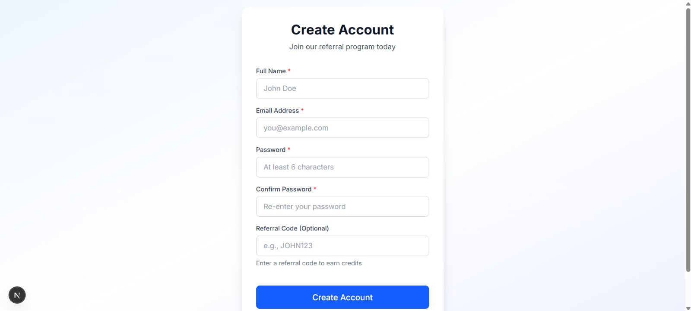
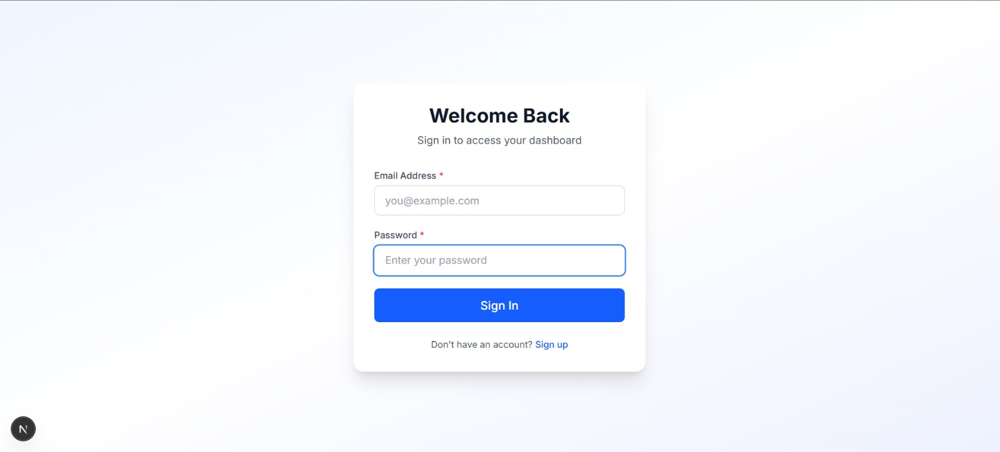
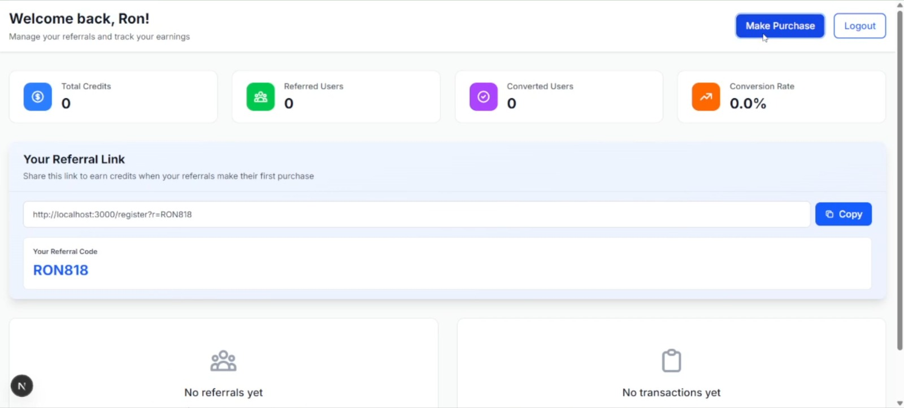
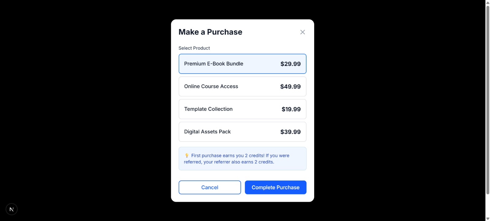

# FileSure Referral & Credit System

A full-stack referral and credit management system that enables users to earn credits by referring friends. Built with modern technologies including Next.js, Express, MongoDB, TypeScript, and Zustand.


---

## 📋 Table of Contents

- [Features](#features)
- [Tech Stack](#tech-stack)
- [System Architecture](#system-architecture)
- [Screenshots](#screenshots)
- [Setup Instructions](#setup-instructions)
- [Environment Variables](#environment-variables)
- [API Documentation](#api-documentation)
- [Business Logic](#business-logic)
- [Project Structure](#project-structure)
- [Deployment](#deployment)

---

## ✨ Features

### User Authentication
- ✅ Secure registration with email and password
- ✅ JWT-based authentication
- ✅ Password hashing with bcrypt
- ✅ Protected routes and API endpoints

### Referral System
- ✅ Unique referral code generation for each user
- ✅ Referral link sharing with query parameters
- ✅ Automatic referrer-referred relationship tracking
- ✅ Status tracking (pending → converted)

### Credit Management
- ✅ Credit rewards on first purchase (2 credits each)
- ✅ Transaction-based credit processing
- ✅ Double-crediting prevention
- ✅ Complete audit trail with credit transactions

### User Dashboard
- ✅ Real-time statistics display
- ✅ Total referred users count
- ✅ Converted users tracking
- ✅ Total credits earned
- ✅ Conversion rate calculation
- ✅ Referral link with one-click copy
- ✅ Referred users list with status
- ✅ Transaction history timeline

### Purchase Simulation
- ✅ Multiple product selection
- ✅ First purchase detection
- ✅ Automatic credit distribution
- ✅ Purchase history tracking

---

## 🛠️ Tech Stack

### Frontend
- **Framework:** Next.js 14 (App Router)
- **Language:** TypeScript
- **Styling:** Tailwind CSS
- **State Management:** Zustand
- **HTTP Client:** Axios
- **Animations:** Framer Motion
- **UI Components:** Custom-built with Tailwind

### Backend
- **Runtime:** Node.js
- **Framework:** Express.js
- **Language:** TypeScript
- **Database:** MongoDB with Mongoose ODM
- **Authentication:** JWT (jsonwebtoken)
- **Password Hashing:** bcryptjs
- **Validation:** express-validator
- **CORS:** cors package

### Database
- **MongoDB Collections:**
  - `users` - User accounts and referral codes
  - `referrals` - Referral relationships
  - `purchases` - Purchase records
  - `creditTransactions` - Credit audit trail

---

## 🏗️ System Architecture

### High-Level Architecture


### Data Flow Diagrams

#### 1. User Registration Flow


#### 2. First Purchase & Credit Award Flow


---

## 📸 Screenshots

### Landing Page

*Modern landing page with call-to-action buttons and feature highlights*

### Registration Page

*User registration with optional referral code input*

### Login Page

*Secure login interface with form validation*

### Dashboard

*Comprehensive dashboard showing stats, referral link, and activity*

### Purchase Modal

*Product selection interface with credit information*

---

## 🚀 Setup Instructions

### Prerequisites

- **Node.js** v18.0.0 or higher ([Download](https://nodejs.org/))
- **MongoDB** v5.0 or higher ([Download](https://www.mongodb.com/try/download/community))
- **Git** ([Download](https://git-scm.com/))
- **npm** or **yarn** package manager

### Step 1: Clone the Repository

```bash
git clone https://github.com/YOUR_USERNAME/filesure-referral-system.git
cd filesure-referral-system
```

### Step 2: Backend Setup

```bash
# Navigate to backend directory
cd backend

# Install dependencies
npm install

# Create environment file
cp .env.example .env

# Edit .env with your configurations
# Update MONGODB_URI, JWT_SECRET, etc.
```

### Step 3: Frontend Setup

```bash
# Navigate to frontend directory (from project root)
cd ../frontend

# Install dependencies
npm install

# Create environment file
cp .env.example .env.local

# Edit .env.local with your API URL
```

### Step 4: Database Setup

**Option 1: Local MongoDB**
```bash
# Start MongoDB service
# Windows:
net start MongoDB

# macOS:
brew services start mongodb-community

# Linux:
sudo systemctl start mongod
```

**Option 2: MongoDB Atlas (Cloud)**
1. Create account at https://www.mongodb.com/cloud/atlas
2. Create a free cluster
3. Get connection string
4. Update `MONGODB_URI` in backend `.env`

### Step 5: Start the Application

**Terminal 1 - Backend:**
```bash
cd backend
npm run dev
```
Backend runs on: http://localhost:5000

**Terminal 2 - Frontend:**
```bash
cd frontend
npm run dev
```
Frontend runs on: http://localhost:3000

### Step 6: Test the Application

1. Open http://localhost:3000
2. Register a new account
3. Copy your referral link
4. Open in incognito window and register with referral code
5. Make a purchase to test credit distribution

---

## 🔐 Environment Variables

### Backend Environment Variables (`.env`)

| Variable | Description | Example |
|----------|-------------|---------|
| `PORT` | Server port number | `5000` |
| `NODE_ENV` | Environment mode | `development` or `production` |
| `MONGODB_URI` | MongoDB connection string | `mongodb://localhost:27017/filesure-referral` |
| `JWT_SECRET` | Secret key for JWT signing | Generate with: `node -e "console.log(require('crypto').randomBytes(64).toString('hex'))"` |
| `JWT_EXPIRES_IN` | JWT token expiration | `7d` |
| `FRONTEND_URL` | Frontend URL for CORS | `http://localhost:3000` |
| `REFERRAL_CREDIT_AMOUNT` | Credits for referrer | `2` |
| `PURCHASE_CREDIT_AMOUNT` | Credits for purchase | `2` |

### Frontend Environment Variables (`.env.local`)

| Variable | Description | Example |
|----------|-------------|---------|
| `NEXT_PUBLIC_API_URL` | Backend API base URL | `http://localhost:5000/api` |

**⚠️ Security Notes:**
- Never commit `.env` files to Git
- Use strong, randomly generated JWT secrets
- In production, use HTTPS URLs
- Keep MongoDB credentials secure

---

## 📡 API Documentation

### Base URL
```
Development: http://localhost:5000/api
Production: https://your-domain.com/api
```

### Authentication Endpoints

#### Register User
```http
POST /api/auth/register
Content-Type: application/json

{
  "name": "John Doe",
  "email": "john@example.com",
  "password": "password123",
  "referralCode": "JANE456"  // Optional
}

Response: 201 Created
{
  "success": true,
  "message": "User registered successfully",
  "data": {
    "token": "eyJhbGciOiJIUzI1NiIsInR5cCI6IkpXVCJ9...",
    "user": {
      "id": "507f1f77bcf86cd799439011",
      "email": "john@example.com",
      "name": "John Doe",
      "referralCode": "JOHN123",
      "totalCredits": 0
    }
  }
}
```

#### Login User
```http
POST /api/auth/login
Content-Type: application/json

{
  "email": "john@example.com",
  "password": "password123"
}

Response: 200 OK
{
  "success": true,
  "message": "Login successful",
  "data": {
    "token": "eyJhbGciOiJIUzI1NiIsInR5cCI6IkpXVCJ9...",
    "user": { ... }
  }
}
```

#### Get Current User
```http
GET /api/auth/me
Authorization: Bearer {token}

Response: 200 OK
{
  "success": true,
  "data": {
    "user": { ... }
  }
}
```

### Purchase Endpoints

#### Create Purchase
```http
POST /api/purchases
Authorization: Bearer {token}
Content-Type: application/json

{
  "productName": "Premium E-Book Bundle",
  "amount": 29.99
}

Response: 201 Created
{
  "success": true,
  "message": "Purchase completed successfully",
  "data": {
    "purchase": { ... },
    "creditInfo": {
      "success": true,
      "message": "Credits awarded: 2 to referrer, 2 to buyer"
    }
  }
}
```

#### Get Purchase History
```http
GET /api/purchases
Authorization: Bearer {token}

Response: 200 OK
{
  "success": true,
  "data": {
    "purchases": [ ... ]
  }
}
```

### Dashboard Endpoints

#### Get Dashboard Stats
```http
GET /api/dashboard/stats
Authorization: Bearer {token}

Response: 200 OK
{
  "success": true,
  "data": {
    "user": { ... },
    "stats": {
      "totalReferredUsers": 10,
      "convertedUsers": 4,
      "totalCreditsEarned": 8,
      "conversionRate": "40.0"
    },
    "referredUsers": [ ... ],
    "recentTransactions": [ ... ]
  }
}
```

### Referral Endpoints

#### Validate Referral Code
```http
GET /api/referrals/validate/:code

Response: 200 OK
{
  "success": true,
  "message": "Valid referral code",
  "data": {
    "valid": true,
    "referrerName": "John Doe",
    "referralCode": "JOHN123"
  }
}
```

### Error Responses

All endpoints return consistent error format:
```json
{
  "success": false,
  "message": "Error description",
  "errors": [
    {
      "field": "email",
      "message": "Email is required"
    }
  ]
}
```

**Common HTTP Status Codes:**
- `200` - Success
- `201` - Created
- `400` - Bad Request (validation error)
- `401` - Unauthorized (invalid/missing token)
- `404` - Not Found
- `500` - Internal Server Error

### Postman Collection

Import the complete API collection: [Download Postman Collection](./docs/postman-collection.json)

---

## 💼 Business Logic

### Referral System Rules

1. **User Registration**
   - Each user receives a unique referral code (e.g., `JOHN123`)
   - Referral codes are generated from user's name + 3 random digits
   - Users can register with or without a referral code

2. **Referral Tracking**
   - When User B registers with User A's code, a referral relationship is created
   - Initial status: `pending`
   - Relationship is stored in the `referrals` collection

3. **Credit Distribution**
   - Credits are awarded ONLY on the first purchase by the referred user
   - **Referrer (User A):** Receives 2 credits
   - **Referred User (User B):** Receives 2 credits
   - Subsequent purchases by User B do NOT generate additional credits

4. **Double-Crediting Prevention**
   - MongoDB transactions ensure atomic operations
   - `creditsAwarded` flag prevents duplicate rewards
   - `hasMadePurchase` flag tracks first purchase
   - `referralCreditProcessed` flag on purchases

5. **Credit Audit Trail**
   - All credit changes recorded in `creditTransactions` collection
   - Includes type, amount, description, and related IDs
   - Provides complete history for transparency

### Database Schema Design

#### Users Collection
```javascript
{
  _id: ObjectId,
  email: String (unique, indexed),
  password: String (hashed),
  name: String,
  referralCode: String (unique, indexed),
  referredBy: ObjectId | null (ref: users),
  totalCredits: Number (default: 0),
  hasMadePurchase: Boolean (default: false),
  createdAt: Date,
  updatedAt: Date
}
```

#### Referrals Collection
```javascript
{
  _id: ObjectId,
  referrerId: ObjectId (ref: users, indexed),
  referredUserId: ObjectId (ref: users, unique, indexed),
  status: String (enum: ['pending', 'converted']),
  creditsAwarded: Boolean (default: false),
  convertedAt: Date | null,
  createdAt: Date
}
```

#### Purchases Collection
```javascript
{
  _id: ObjectId,
  userId: ObjectId (ref: users, indexed),
  productName: String,
  amount: Number,
  isFirstPurchase: Boolean,
  referralCreditProcessed: Boolean (default: false),
  createdAt: Date
}
```

#### CreditTransactions Collection
```javascript
{
  _id: ObjectId,
  userId: ObjectId (ref: users, indexed),
  amount: Number (can be positive or negative),
  type: String (enum: ['referral_reward', 'purchase_reward', 'deduction', 'bonus']),
  description: String,
  relatedPurchaseId: ObjectId | null,
  relatedReferralId: ObjectId | null,
  createdAt: Date
}
```

### Transaction Safety

The credit distribution process uses MongoDB transactions to ensure:
- **Atomicity:** All credit operations complete together or none do
- **Consistency:** Database remains in valid state
- **Isolation:** Concurrent transactions don't interfere
- **Durability:** Committed changes persist

```typescript
// Credit distribution with transaction
const session = await mongoose.startSession();
await session.startTransaction();

try {
  // 1. Update referrer credits
  // 2. Update referred user credits
  // 3. Create credit transactions
  // 4. Update referral status
  // 5. Mark purchase as processed
  
  await session.commitTransaction();
} catch (error) {
  await session.abortTransaction();
  throw error;
} finally {
  session.endSession();
}
```

---

## 📁 Project Structure

```
filesure-referral-system/
├── backend/
│   ├── src/
│   │   ├── config/
│   │   │   └── database.ts              # MongoDB connection
│   │   ├── models/
│   │   │   ├── User.ts                  # User schema
│   │   │   ├── Referral.ts              # Referral schema
│   │   │   ├── Purchase.ts              # Purchase schema
│   │   │   └── CreditTransaction.ts     # Credit transaction schema
│   │   ├── middleware/
│   │   │   ├── auth.ts                  # JWT authentication
│   │   │   └── validation.ts            # Request validation
│   │   ├── routes/
│   │   │   ├── auth.routes.ts           # Auth endpoints
│   │   │   ├── purchase.routes.ts       # Purchase endpoints
│   │   │   ├── dashboard.routes.ts      # Dashboard endpoints
│   │   │   ├── referral.routes.ts       # Referral endpoints
│   │   │   └── index.ts                 # Route aggregation
│   │   ├── controllers/
│   │   │   ├── auth.controller.ts       # Auth logic
│   │   │   ├── purchase.controller.ts   # Purchase logic
│   │   │   ├── dashboard.controller.ts  # Dashboard logic
│   │   │   └── referral.controller.ts   # Referral logic
│   │   ├── utils/
│   │   │   ├── generateReferralCode.ts  # Code generator
│   │   │   └── creditManager.ts         # Credit distribution
│   │   └── server.ts                    # Express app entry
│   ├── .env.example
│   ├── .gitignore
│   ├── package.json
│   └── tsconfig.json
│
├── frontend/
│   ├── app/
│   │   ├── dashboard/
│   │   │   └── page.tsx                 # Dashboard page
│   │   ├── login/
│   │   │   └── page.tsx                 # Login page
│   │   ├── register/
│   │   │   └── page.tsx                 # Register page
│   │   ├── layout.tsx                   # Root layout
│   │   ├── page.tsx                     # Home page
│   │   └── globals.css                  # Global styles
│   ├── components/
│   │   ├── auth/
│   │   │   ├── LoginForm.tsx            # Login component
│   │   │   └── RegisterForm.tsx         # Register component
│   │   ├── dashboard/
│   │   │   ├── StatsCard.tsx            # Stats display
│   │   │   ├── ReferralLink.tsx         # Referral link widget
│   │   │   ├── ReferralsList.tsx        # Referrals table
│   │   │   └── TransactionHistory.tsx   # Transactions list
│   │   ├── purchase/
│   │   │   └── PurchaseModal.tsx        # Purchase modal
│   │   └── ui/
│   │       ├── Button.tsx               # Button component
│   │       ├── Input.tsx                # Input component
│   │       └── Card.tsx                 # Card component
│   ├── lib/
│   │   ├── api.ts                       # API client
│   │   ├── auth.ts                      # Auth helpers
│   │   └── utils.ts                     # Utility functions
│   ├── store/
│   │   ├── authStore.ts                 # Auth state (Zustand)
│   │   └── dashboardStore.ts            # Dashboard state (Zustand)
│   ├── types/
│   │   └── index.ts                     # TypeScript types
│   ├── .env.example
│   ├── .gitignore
│   ├── next.config.js
│   ├── tailwind.config.ts
│   └── package.json
│
├── docs/
│   ├── screenshots/                      # Application screenshots
│   ├── architecture-diagram.png          # System architecture
│   ├── user-registration-flow.png        # Registration flow diagram
│   ├── purchase-credit-flow.png          # Purchase flow diagram
│   └── postman-collection.json           # API collection
│
├── .gitignore
└── README.md
```

---

## 🚀 Deployment

### Frontend Deployment (Vercel)

1. Push code to GitHub
2. Visit [Vercel Dashboard](https://vercel.com)
3. Click "New Project"
4. Import your GitHub repository
5. Configure:
   - **Framework:** Next.js
   - **Root Directory:** `frontend`
   - **Build Command:** `npm run build`
   - **Output Directory:** `.next`
6. Add environment variables:
   - `NEXT_PUBLIC_API_URL`: Your backend URL
7. Deploy!

### Backend Deployment (Vercel)

1. In Vercel, create another project
2. Import same repository
3. Configure:
   - **Framework:** Other
   - **Root Directory:** `backend`
   - **Build Command:** `npm run build`
   - **Output Directory:** `dist`
4. Add all environment variables from `.env.example`
5. Deploy!


---

## 👨‍💻 Author

**Your Name**
- GitHub: [@SajidenOfnir](https://github.com/SajidenOfnir)
- Email: sksajidh112@gmail.com

---

## 🙏 Acknowledgments

- Assignment provided by FileSure
- Built as part of Full Stack Developer (Mid-Level) assessment

---

## 📞 Support

For issues or questions:
- Open an issue on GitHub
- Email: sksajidh112@gmail.com

---

**⭐ If you found this project helpful, please give it a star!**